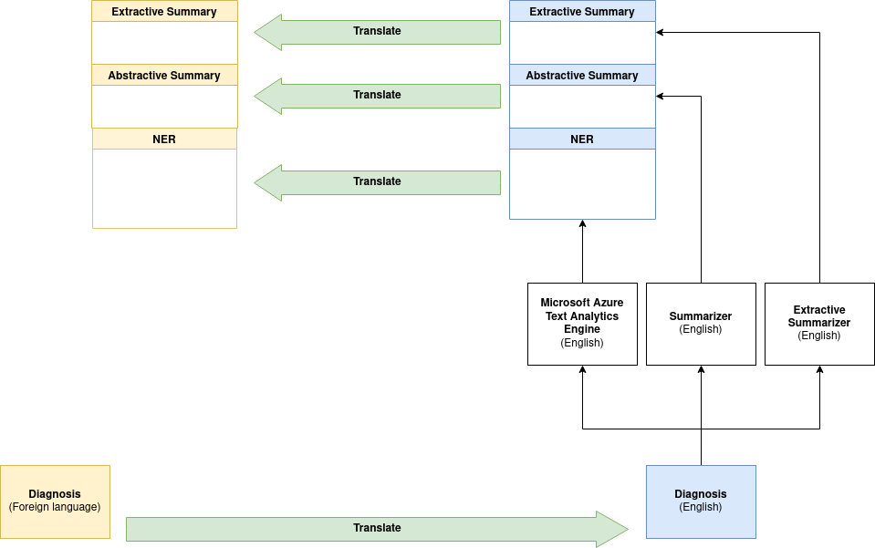
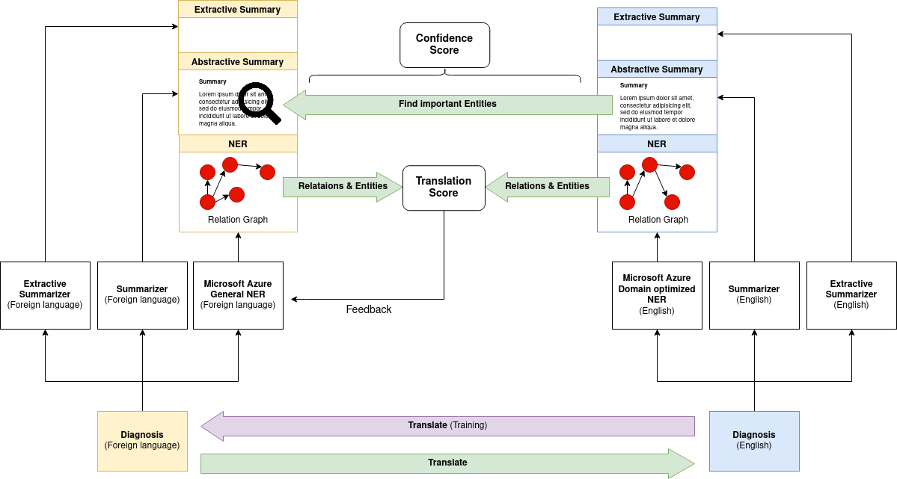

# No(t as much) Loss in Translation (NoLIT)
## 🏆 1st prize Microsoft Challenge: Multilingual Text Analytics for Healthcare [ML Hackathon](https://datadays.ch/#datathon)
Presentation: [PDF](https://github.com/FatjonZOGAJ/multilingual-text-analytics/blob/master/ML%20Hackathon%20-%20Terminators%20NoLIT.pdf), [PPTX](https://github.com/FatjonZOGAJ/multilingual-text-analytics/blob/master/ML%20Hackathon%20-%20Terminators%20NoLIT.pptx)
### Problem:

Doctors and patients might not share a common language.
Diagnosis might be overwhelmingly long and confusing.

### Goal:

Make diagnosis accessible and understandable for patients.
Improve their decision making.
Optimise their treatment and recovery.

### Solution:

* Shorter pipeline due to fewer translation steps
* Transfer learning based on  data augmentation leveraging extensive English medical data, translated using task specific pre-trained models 
* Evaluation confidence using a newly proposed EOP score enabling human-in-the-loop feedback

## Architecture
### Original Pipeline
Text is translated to English and then back to the original language.

### Proposed Pipeline
Extends the original pipeline with an additional branch and compares the results to access precision.

### Tasks
- [x] EN-DE Translation
- [x] DE-EN Translation
- [x] EN Summarization
- [x] DE Summarization
- [x] EN Extractive Summary
- [x] DE Extractive Summary
- [x] EN NLP
- [x] EN-DE Entity translation
- [x] Entity Matching

### Steps to run and reproduce

### For setup, source our setup.sh script. 
This will create the environment and set the environment variables.

#### Please install the dependencies from requirements.txt

### To run our complete pipeline, 
Please run the Pipeline.ipynb file in notebooks/. Our pipeline takes care of all function calls automcatically.

Enjoy!
